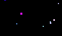

# PointsCollision

This is a task for predicting collisions of points in a near future.

For that task i write gymnasium environment, that create some amount (from min_points to max_points) of points with different radius (from min_radius to max_radius). When environment make a step, it initiates move of that points in the space. Points have colors, that describe their params, where green color is direction of moving and blue is velocity of that object. Red is always 255 for objects, observation space is (0,0,0) rgb.

This project is currently in developing...